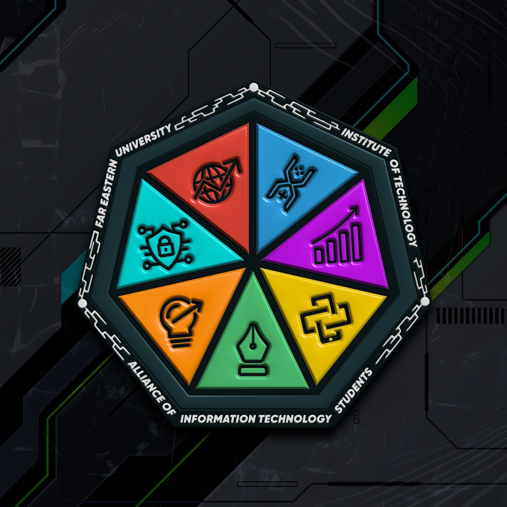

<a name="readme-top">

<br/>

<br />
<div align="center">
  <a href="">
    
  </a>
  <h3 align="center">TechSavvy Solutions</h3>
</div>
<!-- Complete this-->
<div align="center">
    React-Tauri Environment Systems: Sample Project
</div>

<br />

---

<br />
<br />

<details>
  <summary>Table of Contents</summary>
  <ol>
    <li>
      <a href="#overview">Overview</a>
      <ol>
        <li>
          <a href="#key-components">Key Components</a>
        </li>
        <li>
          <a href="#technology">Technology</a>
        </li>
      </ol>
    </li>
    <li>
      <a href="#installation">Installation</a>
    </li>
  </ol>
</details>

---

## Overview

To be added soon... 🚧👷🚧

### Key Components
- Has Server and Client-Side
- 4 Page website
To be completed soon... 🚧👷🚧

### Technology
- 
- 
- 

Framework for Desktop
- 

Web Framework
- 

Design Framework
- 
- 

## Installation
Follow these steps to set up and run the project:

> Note: Make sure you are working under your directory files

1. Install Dependencies
```sh
# for npm
npm install

# for bun
bun install

# for yarn
yarn install
```

2. Install App Dependencies
```sh
# For npm
npm run postinstall

# for bun
bun postinstall

# For yarn
yarn run postinstall
```
3. Install App Dependencies
```sh
# For npm
npm run postinstall

# for bun
bun postinstall

# For yarn
yarn run postinstall
```

4. Start the development server
```sh
# For npm
npm run dev

# for bun
bun dev

# For yarn
yarn run dev
```

5. Start the development application
```sh
# For npm
npm run dev

# for bun
bun dev

# For yarn
yarn run dev
```

6. Package the application: Universal
```sh
# For npm
npm run build

# for bun
bun build

# For yarn
yarn run build
```
   1. For Windows only
```sh
# For npm
npm run build:win

# for bun
bun build:win

# For yarn
yarn run build:win
```
   2. For Linux only
```sh
# For npm
npm run build:linux

# for bun
bun build:linux

# For yarn
yarn run build:linux
```
   3. For Mac only
```sh
# For npm
npm run build:mac

# for bun
bun build:mac

# For yarn
yarn run build:mac
```

7. Preview the Application in Browser
```sh
# For npm
npm run start

# for bun
bun start

# For yarn
yarn run start
```